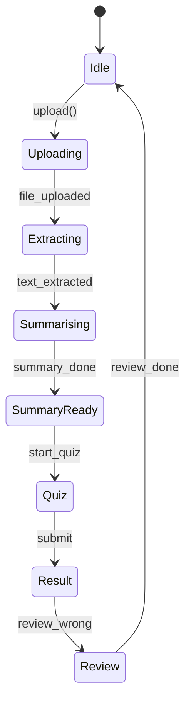

# 🖥️ 엔드투엔드 UX 순차 와이어프레임 명세 v3.1 (KOR)

> **범위** – **모든 사용자 상태**(게스트, 로그인, 오류, 오프라인)와 **주요 태스크 플로우**(랜딩 ▶︎ 로그인 ▶︎ 요약 ▶︎ 퀴즈 ▶︎ 오답 복습 ▶︎ 마이페이지)를 단계별로 설명합니다.\
> 기술 스택: Next.js 15 · React 19 · Azure Foundry · Supabase.\
> 업데이트: 2025‑07‑14 17:30 KST

---

## 0 · 기본 UX 원칙

| 영역            | 가이드라인                          | 이유                  |
| ------------- | ------------------------------ | ------------------- |
| **일관성**       | CTA 색·위치 고정(Primary #2563EB)   | 사용자가 근육 기억으로 빠르게 학습 |
| **점진적 노출**    | 게스트엔 핵심 가치만, 로그인 후 기능 전체 노출    | 정보 과부하 방지           |
| **우아한 오류 처리** | 오프라인·API 오류 시 로컬 캐시 및 재시도      | 통학·모바일 환경 대비        |
| **접근성**       | WCAG 2.2 AA, 색 대비 ≥4.5, 키보드 내비 | 글로벌 학습자 대응          |

---

## 1 · 전역 정보 구조(IA)

```mermaid
graph TD
  G0[랜딩(게스트)] --> G1[로그인/회원가입]
  G1 -->|성공| A0[대시보드]
  A0 --> A1[요약 플로우]
  A0 --> A2[오답 복습 플로우]
  A0 --> A3[마이페이지]
  A1 --> A1-1[업로드] --> A1-2[메타] --> A1-3[요약 결과] --> A1-4[퀴즈 풀이] --> A1-5[퀴즈 결과] --> A1-6[오답 복습]
  style G0 fill:#F1F5F9,stroke:#94A3B8
  style G1 fill:#E2E8F0
  style A0 fill:#FFF7ED,stroke:#FBBF24
```

색상: **회색** = 게스트, **노랑** = 로그인 허브.

---

## 2 · 화면별 순차 와이어프레임

### 2‑A · 게스트 플로우

#### G‑0 랜딩 `/`

```
┌─────────────────────────────────────────┐
│  로고          [로그인]   [KR/EN]       │
├─────────────────────────────────────────┤
│        ✨ 5분 만에 요약·퀴즈 ✨          │
│      [Google로 시작하기]               │
│─────────────────────────────────────────│
│  ▢ AI 요약  ▢ 맞춤 퀴즈  ▢ 오답 루프   │
│─────────────────────────────────────────│
│  3단계 사용 방법 일러스트              │
└─────────────────────────────────────────┘
```

#### G‑1 로그인 `/login`

- **소셜 버튼**: Google, Microsoft (학교 메일) 전체 폭.
- 성공 시 `/home?next=이전경로` 리다이렉트.
- 실패 시 모달(재시도·문의).

---

### 2‑B · 로그인 허브

#### A‑0 대시보드 `/home`

```
┌──────────────────────────────────────────────┐
│ 로고 | 📁 업로드 | 🔔 | 👤                  │
├──────────────────────────────────────────────┤
│ 안녕하세요, 소연님 👋 (GMT+9)                │
│ 평균 점수 72 % | 마지막 세션 3일 전          │
├──────────────────────────────────────────────┤
│ [ 새 요약 시작 ]   [ 오답 복습 이어하기 ]    │
├──────────────────────────────────────────────┤
│ ▢ 진행 중 요약 #215   ▶ 계속하기            │
│ ▢ 진행 중 퀴즈 2/5    ▶ 이어하기            │
└──────────────────────────────────────────────┘
```

모바일(<768px)에서는 CTA 세로 정렬, 하단 고정 업로드 FAB.

---

### 2‑C · 요약 플로우

#### A1‑1 업로드 `/summary?page=upload`

```
[Breadcrumb: 업로드 ▸ 메타 ▸ 요약]
┌─────────────────────────────────────┐
│          ⬇ 드래그 & 드롭           │
│    또는 클릭(최대 50 MB)            │
└─────────────────────────────────────┘

           [다음 ▸] (파일 선택 전 비활성)
```

오프라인 시 `indexedDB`에 파일 캐시 후 재연결 시 전송.

#### A1‑2 메타 `/summary?page=meta`

```
과목명: [ 자동감지값 ▾ ]
스타일: [ 간단 요약 ] (고정)
[◂ 이전]                       [요약 생성 ▸]
```

#### A1‑3 요약 결과 `/summary?page=summary`

```
📑 목차 패널 ┆ Markdown 뷰어
──────────────────────────────────────
            [ 퀴즈 시작 ] CTA
```

---

### 2‑D · 퀴즈 플로우

#### A1‑4 퀴즈 풀이 `/quiz`

```
진행률 40 % (2/5)          ⏱ 03:12
──────────────────────────────────────
Q2 주요 이점은 무엇인가?
 ( ) A   (•) B   ( ) C
──────────────────────────────────────
[◂ 이전]         [다음 ▸] [제출]
```

즉시 채점 모드 기본, 배치 채점 토글 지원.

#### A1‑5 퀴즈 결과 `/quiz/result`

```
🎯 4 / 5 (80 %)   ▇▇▇▇▇▇▇▇
약점 태그: • NPV • IRR
──────────────────────────
[ 오답 복습 ]   [ 대시보드 ]
```

#### A1‑6 오답 복습 `/quiz/review`

```
오답 개념
▸ NPV (2)
▸ IRR (1)
───────────────────
Q1 …  ( ) A (•) B ✔
───────────────────
진행 링 ●●○ 60 %
```

모두 맞을 때까지 루프.

---

### 2‑E · 마이페이지 `/mypage`

```
┌─────────────────────────────────────────┐
│ 탭: 개요 | 요약 | 퀴즈                    │
├─────────────────────────────────────────┤
│ KPI 카드: 총 퀴즈 · 평균 점수 …          │
│─────────────────────────────────────────│
│ 📅 캘린더 히트맵                        │
│─────────────────────────────────────────│
│ 최근 요약 테이블                        │
└─────────────────────────────────────────┘
```

---

## 3 · 오류·오프라인 처리

| 상태               | 트리거                      | UX 처리                  |
| ---------------- | ------------------------ | ---------------------- |
| **401**          | 게스트가 보호 페이지 접근           | 로그인 모달, 성공 시 원래 경로로 복귀 |
| **파일 초과**        | 50 MB 초과                 | 빨간 안내 + 흔들림 애니메이션      |
| **Foundry 시간초과** | 30 s 초과                  | 토스트 “재시도 · 문의”         |
| **오프라인**         | `navigator.onLine=false` | 상단 배너 “오프라인 – 로컬 저장 중” |

---

## 4 · 반응형 레이아웃

| 폭          | 전략             | 주요 조정        |
| ---------- | -------------- | ------------ |
| ≥1280px    | 2열(목차+본문)      | 측면 280 px 고정 |
| 768–1279px | 1열 + 상단 드로어 목차 | 헤더 고정 진행바    |
| <768px     | 전폭 · 하단 CTA 고정 | 기본 폰트 14 px  |

---

## 5 · 마이크로 인터랙션

| 시나리오      | 애니메이션         | 도구                       | 시간     |
| --------- | ------------- | ------------------------ | ------ |
| 파일 드롭 성공  | 테두리 초록 점멸     | Tailwind `animate‑pulse` | 150 ms |
| 답안 선택(즉시) | 카드 Y축 회전 → 해설 | Framer Motion            | 250 ms |
| 점수 ≥90%   | 결과 카드 콘페티     | `canvas‑confetti`        | 2 s    |

---

## 6 · 접근성 체크리스트

- 모든 일러스트 `alt` 텍스트.
- 요약 생성 진행률 `role="status"`.
- 모달 포커스 트랩.
- 색맹 시뮬레이터로 대비 확인.

---

## 7 · 상태 머신(XState)



---

## 8 · Cursor / Copilot 구현 프롬프트 예시

1. **오답 복습 페이지** – “`/quiz/review` 페이지: wrongOnly 쿼리로 문항 받아 `ReviewQuizCard` 렌더하고 답안 제출 구현.”
2. **대시보드 히트맵** – “`react-calendar-heatmap`를 사용해 Supabase RPC `weak_tags()` 결과 시각화.”
3. **오프라인 배너** – “online/offline 이벤트 감지해 상단 배너 표시 컴포넌트 작성.”

---

### ✅ 완료 기준

- 게스트·로그인 전 흐름 100 % 문서화.
- 오류·오프라인 시나리오 포함.
- 프롬프트 기반 코드 생성 가능 상태.

> **다음 단계**: Figma에 프레임화 → 하이파이 디자인 착수.

